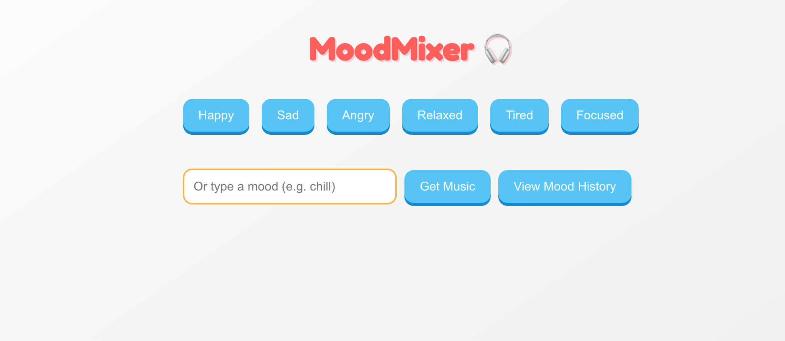
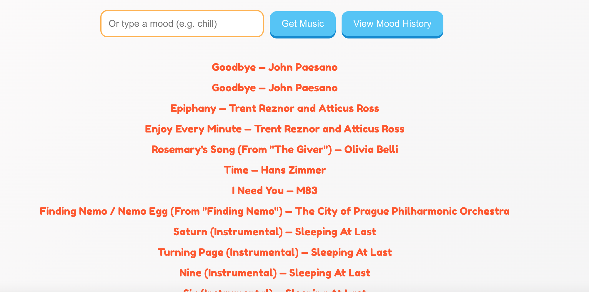
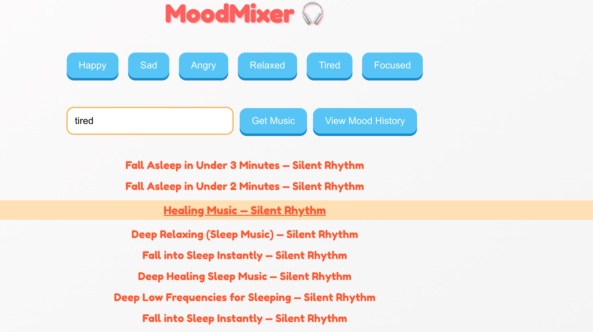
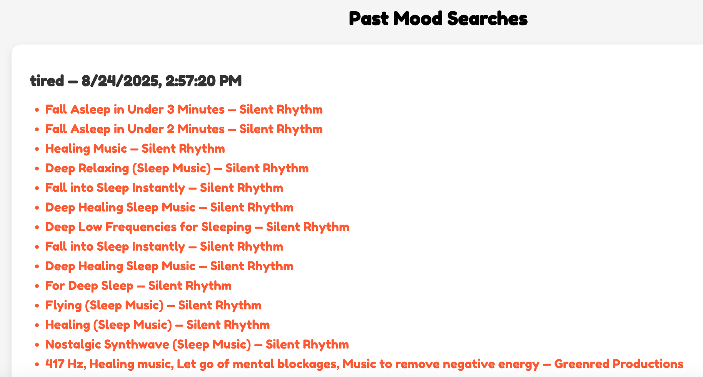

MoodMixer
=========

MoodMixer is a web application that uses the Spotify API to generate playlists based on a user’s selected mood, while also letting them keep a mood journal and track listening history.
Live Demo:https://moodmixer-khaki.vercel.app/

Table of Contents
-----------------

*   Overview
    
*   Tech Stack
    
*   Setup / Installation
    
*   Demo
    
*   Future Features
    

Overview
--------

Once authorized, MoodMixer connects with Spotify to fetch music that matches the user’s chosen mood. The app also provides:

*   A **History** view to revisit past moods and generated playlists
    

Playlists can be viewed and played directly inside MoodMixer, as well as in Spotify itself.

Tech Stack
----------

*   Frontend: ReactJS, JavaScript, Axios, CSS
    
*   Backend: Node.js, Express.js
    
*   Database: MongoDB with Mongoose
    
*   APIs: Spotify Web API
    

Setup / Deployment
------------------

*   **Step 1 – Get Spotify Credentials:**  
    Go to the [Spotify Developer Dashboard](https://developer.spotify.com/dashboard) and create an app.  
    Copy your **Client ID** and **Client Secret**.  

*   **Step 2 – Configure Environment Variables:**  
    Add the following variables in your backend deployment platform (Render, Railway, or Heroku):  

    ```
    SPOTIFY_CLIENT_ID=YOUR_KEY
    SPOTIFY_CLIENT_SECRET=YOUR_KEY
    SPOTIFY_REDIRECT_URI=https://your-backend-host.com/auth/callback
    MONGO_URI=your_mongo_connection_string
    SESSION_SECRET=replace_me
    ```

    For the frontend (Vercel or Netlify), add:  

    ```
    VITE_API_BASE_URL=https://your-backend-host.com
    ```

*   **Step 3 – Deploy Backend:**  
    - Push the backend folder to GitHub.  
    - Create a new Web Service on Render, Railway, or Heroku.  
    - Link it to your backend repo and add the environment variables.  
    - Deploy and note your backend URL.  

*   **Step 4 – Deploy Frontend:**  
    - Push the frontend folder to GitHub.  
    - Deploy using Vercel or Netlify.  
    - Set the environment variable `VITE_API_BASE_URL` to your backend URL.  
    - Deploy and note your frontend URL.  

*   **Step 5 – Update Spotify App Settings:**  
    - In the Spotify Developer Dashboard, set the Redirect URI to match your backend redirect (for example, `https://your-backend-host.com/auth/callback`).  
    - Add your frontend URL to the allowed origins.  

*   **Step 6 – Run the App:**  
    Open your deployed frontend URL, log in with Spotify, select a mood, and start generating playlists!  

    

Demo
----

*   **Home page:** Enter or select a mood to generate a playlist.  
    * Screenshot: 

*   **Mood click:** Clicking on the mood you feel.  
    * Screenshot: 

*   **Mood search:** Searching for your mood.  
    * Screenshot: 

*   **History:** See all previous playlists generated by your moods.  
    * Screenshot: 


Possible future Features
---------------

*   Add more usable features like selecting favorite playlists and songs.

*   Fine-tune the mood-to-music matching algorithm.
    
*   Export playlists directly to Spotify.
    
*   Add AI-powered sentiment detection from journal entries.
    
*   Provide user profiles with personalized mood insights.
    
